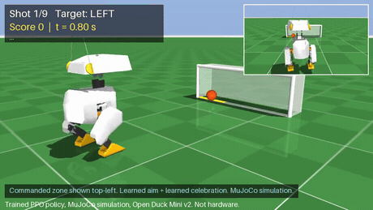

# Microduck Penalty Shootout: told where to shoot, 58 of 60 on target (PPO, simulated)

Trained, closed-loop soccer policies for the Microduck (Open Duck Mini v2) in MuJoCo that are *told where to shoot*.
Before each shot the robot is commanded one of three zones of a goal 1 m away (left, centre, right) and must put the
ball in that zone. Built for the HIM Arena Microduck Sports Challenge (`microduck-sports-sim-2026`).
**Simulation only. Nothing here has been validated on real hardware.**

Source: <https://github.com/sdm-commits/microduck-sports-challenge>

Two evaluations are shipped, both scored, both reproducible from this archive:

| Evaluation | What the robot does | Result |
|---|---|---|
| **standing penalty shootout** (`duck_kick.evaluate`) - the headline | starts beside the ball, aims, kicks, celebrates | **58/60 on target**, 59/60 goals, 0 falls; 94.7% over 300 further shots |
| **walk-up match** (`duck_kick.match`) - an extra, documented in full below | starts 0.3-0.6 m away, walks up, lines up, kicks, celebrates | **31/60 on target**, 41/60 goals, 0 falls |

Every controller that moves the robot in either evaluation is a neural network trained by us with PPO on
observations: the walk, the approach, the kick and the celebration. The only hand-written logic is two event
switches (the approach policy's own trigger output, and the scored flag) and the anti-nudge scoring rule.

## Watch it



Two of the nine shots, at double speed. The commanded zone is printed top left and highlighted in yellow on the goal
line, so you can check the call against the outcome. The full clip is **[result.mp4](result.mp4)** (48 s, 9 shots,
seeds 0-8, 8 of them on target). Those are the first nine seeds of the evaluation below, not selected takes;
`scripts/render_result_video.sh` regenerates it.

After a goal the duck celebrates: a second learned policy takes over and bounces, nods and sweeps its head, then
settles back to standing, all on servo torques with the floating base free to fall.

At every 50 Hz control step the controller reads a 63-dim observation (proprioception, ball state, commanded zone,
scored flag) and outputs 14 joint position targets. It is two PPO networks joined by an event switch: the **kick
policy** (49-dim slice of the observation, 10 leg joints, head held at home) acts until the scored flag in the
observation is set; the **celebration policy** (full observation, all 14 joints) acts afterwards. MuJoCo position servos (the STS3215 fit from Open_Duck_Playground)
turn those targets into torques; rigid-body dynamics with contacts (feet-floor, feet-ball, ball-floor, ball-posts,
ball-net) do the rest. Nothing is keyframed or teleported: after `reset()` the only thing that ever moves the ball
is a foot. The sport is scored: a shot counts when the ball crosses the goal line inside the commanded zone.

## Reproduce

```bash
python3 -m venv .venv && . .venv/bin/activate && pip install -r requirements.txt
python -m unittest discover -s tests -v                       # environment / latency / reference / PPO tests
python -m duck_kick.evaluate --shots 60 --json eval_combined.json                 # kick + celebration policies (default)
python -m duck_kick.evaluate --policy zero --shots 60 --json eval_zero.json      # neutral baseline, must not score
python -m duck_kick.evaluate --shots 1 --video result.mp4 --video-shots 9        # 9-shot shootout video with scoreboard
```

Training. Kick policy (`duck_kick/checkpoints/final.pt`) is five warm-started runs; the full table and every exact
command are in `training_evidence.json` and under Results below. The first and last are:

```bash
python -m duck_kick.train --total-steps 40000000 --num-envs 256 --num-workers 64 --seed 0 --out runs/stage1
python -m duck_kick.train --total-steps 20000000 --num-envs 64 --num-workers 8 --seed 86 --out runs/stage6 \
    --init-checkpoint runs/stage5/kick/final.pt --reset-log-std -1.7 \
    --env-overrides '{"reward.aim_precision": 8.0, "celebration.enabled": false}'
```

Celebration policy (`duck_kick/checkpoints/celebration.pt`; the kick policy is frozen and plays every shot, the learner
only controls the post-goal window, shots that miss are re-rolled):

```bash
python -m duck_kick.train --env celebration --kick-checkpoint duck_kick/checkpoints/final.pt \
    --total-steps 12000000 --num-envs 64 --num-workers 8 --seed 5 --out runs/celeb
```

Note: the kick policy was trained on the 49-dim observation / 10-action version of this environment (no head joints,
no scored flag); `duck_kick/policy.py` projects the current 63-dim observation onto that layout, and
`duck_kick/warmstart.py` documents the index map.

## Environment specification (all values live in `duck_kick/config.py`)

| Item | Value |
|---|---|
| Robot | Open Duck Mini v2 MJCF + meshes, unchanged, from Open_Duck_Playground `b9be205` |
| Physics | MuJoCo 3.12, `timestep` 2 ms, 10 substeps per control step, contacts enabled (feet, ball, floor) |
| Control rate | 50 Hz (`ctrl_dt` 0.02 s) |
| Actuators | MJCF `<position>` servos: kp 13.37 Nm/rad, kv 0, force limit +/-3.23 Nm; joint damping 0.56, frictionloss 0.068, armature 0.027 |
| Action | 14 joints, `target = home + 1.0 rad * clip(a, -1, 1)`, clipped to joint range. Kick policy emits the 10 leg targets (head at home); celebration policy emits all 14 |
| Action latency | exactly one control step (target from step t is applied during step t+1; `tests/test_env.py` checks this) |
| Observation (63) | gyro (3), projected gravity (3), leg joint pos - home (10), head joint pos - home (4), leg joint vel (10), head joint vel (4), previous action (14), ball position rel. base in heading frame (3), ball velocity in heading frame (3), phase (2), commanded zone one-hot (3), target point rel. base in heading frame (2), scored flag + celebration phase (2) |
| Goal | line at x = 1.0 m, 0.75 m wide, crossbar 0.25 m; posts, crossbar and net are rigid and stop the ball; zone centres y = +0.25 (left), 0, -0.25 (right), zone half-width 0.125 m; commanded zone sampled uniformly at reset (visual marker highlighted) |
| Ball | sphere r = 0.04 m, 0.05 kg, placed x in [0.070, 0.085] m, y in [-0.105, -0.065] m in front of the right foot |
| Episode | 4.5 s (225 steps); terminates early if base height < 0.09 m or tilt > 60 deg |
| Celebration reference | procedural (`duck_kick/celebration.py`): 1.6 s window after the ball crosses the line, knee bounce 2 Hz (0.35 rad), head yaw sweep 0.9 rad at 1.5 Hz, head nod 0.35 rad at 3 Hz, neck lift, cosine ease in/out |
| Domain randomization | floor friction U(0.5, 1.0); robot body masses x U(0.9, 1.1); ball mass x U(0.8, 1.2); servo kp x U(0.9, 1.1); joint frictionloss x U(0.9, 1.1); reset joint noise U(-0.015, 0.015) rad; uniform observation noise (gyro 0.10, gravity 0.03, joint pos 0.02, joint vel 1.0, ball pos 0.005, ball vel 0.05) |
| Reference motion | procedural right-leg kick in joint space generated by `duck_kick/reference.py` from `ReferenceConfig` (weight shift 0-0.15 s, backswing to 0.32 s, strike to 0.38 s, recover to 0.70 s); no external mocap |
| Reward (per step) | imitation `2 * exp(-20 * mse(q, q_ref))` over all 14 joints (reference = kick for the legs plus head at home before the goal, celebration reference during the window, home afterwards); liveliness `0.3 * (min(|head yaw vel|, 3)/3 + min(|base vz|, 0.3)/0.3)` during the window; target progress `20 * clip(d_prev - d, +/-0.05)` where d = distance from ball to the target point; first foot-ball contact bonus 2.0; approach `0.3 * exp(-|foot - ball| / 0.05)` before contact; tilt `-2 * (g_x^2 + g_y^2)`; height `-2 * |z - 0.16|`; heading `-0.5 * (yaw - yaw_to_target)^2`; action rate `-0.1 * mean(da^2)`; torque `-0.002 * mean(f^2)`; joint vel `-1e-4 * mean(qd^2)`; alive 0.1; fall -5. Once per episode at the crossing: +15 on target, +1 goal in another zone, 0 for a miss, plus the aim-precision bonus `aim_precision * exp(-((crossing_y - target_y)/0.125)^2)` used at `aim_precision = 8` for the final two training runs and 0 elsewhere (the shipped default) |
| Scoring rule | **on target**: foot touched ball, ball crossed x = 1.0 inside the commanded zone below the crossbar, robot did not fall. **goal**: crossed inside the goal mouth (any zone). Shootout score = on-target shots out of N; shot i uses seed i and zone i mod 3 |

## Training setup

PPO (`duck_kick/ppo.py`): clipped objective (eps 0.2), GAE (gamma 0.99, lambda 0.95), 5 epochs, minibatch 1024,
Adam lr 3e-4 decaying linearly to 3e-5, value coef 0.5, no entropy bonus, grad clip 1.0. Actor and critic are
separate 256-256 ELU MLPs with a state-independent Gaussian log-std (init -1.0, floored at -2.0 so exploration
cannot collapse; an unfloored run stalled at 43% on target after its log-std fell to -2.95). Observations are normalized
with running statistics that are frozen into the checkpoint. Rollouts come from 64 CPU MuJoCo environments
in worker processes (`duck_kick/vec_env.py`).

Evaluation uses the deterministic mean action and per-seed RNGs, so `(checkpoint, seed)` reproduces exactly.

## Results

All numbers below were measured in this project; nothing is estimated. Raw evaluation JSON and per-iteration
training metrics for every run, including the discarded ones, are in `evidence/` and
`duck_kick/checkpoints/training_evidence.json`. Evaluation is deterministic: the policies act on their mean output and
each shot's seed fixes the domain randomization, the ball placement and the observation noise, so a
`(checkpoint, seed)` pair reproduces exactly.

### How the kick policy was trained

Five PPO runs in sequence, each warm-starting from the previous one. Training ran on a HIM Compute standard
workspace (NVIDIA L4) for the first two and on an 8-core Apple Silicon Mac for the rest.

| Run | Steps | What changed | Standing shootout |
|---|---:|---|---:|
| 1. from scratch | 40 M | first attempt; an aim penalty that only applied above 0.2 m/s, plus a miss penalty | 9/60 |
| 2. warm start | 20 M | aim and miss penalties removed, on-target bonus raised, log-std floored at -2.0 | 56/60 |
| 3. post-walk states | 16 M | 60% of resets drawn from a bank of real walk-up hand-over states | 55/60 |
| 4. aim precision | 20 M | added the smooth crossing bonus described below | 281/300 |
| 5. aim precision | 20 M | same objective, continued | **856/900 over 900 shots** |

Run 1 is a genuine failure worth reading: because its aim term was a penalty that switched on only once the ball was
moving, the cheapest way to avoid it was to tap the ball gently, and exploration then collapsed (log-std -2.95). Both
faults were fixed in run 2, and the log-std floor has been kept ever since.

Runs 4 and 5 exist because the scoring reward is a cliff. A shot 3 mm inside the zone earned exactly what a shot
through the middle earned, so nothing pushed the spread down: measured lateral error at the goal line had a 90th
percentile of 0.115 m against a zone half-width of 0.125 m. The fix is a bonus paid once, at the crossing, of
`8 * exp(-((crossing_y - target_y) / zone_half_width)^2)`. It is always positive, which matters: an equivalent lateral
*penalty* would have re-created the failure where the policy avoids the goal line altogether.

Judged head to head on **900 shots each on seeds the refinement never trained against**:

| Checkpoint | on target | falls |
|---|---:|---:|
| after refinement (shipped) | **856/900 = 95.1%** | 1 |
| before refinement | 812/900 = 90.2% | 2 |

Difference +4.89 percentage points, 95% CI [+2.49, +7.29]. On a 60-shot sample the same comparison was
inside the noise and an earlier round even looked better on the seeds it had been diagnosed against than on fresh
ones, so the adoption decision was made on the large sample only.

**A sharper version of the same bonus was tried and lost.** With the kernel as wide as the zone, the bonus already pays
82% of its maximum at the policy's measured 5.5 cm mean error, so it saturates. Narrowing it to 0.05 m more than doubles
the gradient there, and it did reduce the systematic bias: with randomization switched off, mean error fell from 5.45 cm
to 3.62 cm. Under randomization it was nonetheless clearly worse, 808/900 against 848/900 with 8 falls against 3
(-4.44 pp, 95% CI [-6.94, -1.95]), so it was discarded and the wider kernel kept. A sharply peaked reward buys precision
in the nominal case and pays for it in tolerance to the mass, friction and gain draws that actually decide shots. Raw
numbers in `evidence/ab_sharpened_kernel_FAILED_900.json`.

### Shipped result: standing penalty shootout

`python -m duck_kick.evaluate --shots 60` runs the kick policy and the celebration policy together. A fall anywhere in
the 4.5 s episode, including during the celebration, voids the shot.

| Policy | on target | goals (any zone) | missed wide | never reached line | falls | foot contacts | celebrated | left | centre | right |
|---|---:|---:|---:|---:|---:|---:|---:|---:|---:|---:|
| trained kick + celebration | **58/60** | 59/60 | 1 | 0 | 0 | 60/60 | 59/60 | 20/20 | 20/20 | 18/20 |
| zero-action baseline | 0/60 | 0/60 | 0 | 60 | 0 | 0/60 | 0/60 | - | - | - |

On a larger, independent set of 300 shots (seeds 3000-3299) the same controller scores 284/300 = 94.7% on target,
297/300 goals, 1 fall. The zero-action baseline never touches the ball, so no part of the result comes from the
scene doing the work.

The celebration policy was trained in two runs with the kick policy frozen and playing every shot: 12 M steps
controlling only the celebration window, then 14 M steps controlling from the goal to the end of the episode so that it
also learns to settle. Shots that miss are re-rolled, so the learner only ever sees post-goal states. Training one
network end to end on both phases instead was tried and failed: it learned to avoid scoring, because after a goal the
reference switches to the harder celebration motion while not scoring lets it track the easy standing pose for the rest
of the episode. That run fell to 16/60 on target and is kept in
`evidence/eval_shootout60_single_network_both_phases_FAILED.json`.

Celebration tracking error is 0.076 rad with a peak head yaw of 45 degrees, on a robot whose floating base is free
to fall throughout.

**Video** (`result.mp4`, 960x540, 9 shots, seeds 0-8, zones cycling left/centre/right): **8/9 on target**. These are the
first 9 seeds of the evaluation above, not selected takes; regenerate it with `scripts/render_result_video.sh`.

Checkpoint SHA-256: kick `12171c220b1d8a5704d54508c3c4284275b7929d9193dae2e43eef8e286f810b`,
celebration `d6e41786427a6ee0fe76f78a0f35735d0e3f9b20c5c2989ca72f022691e2bd12`.

## Walk up and score (learned approach + learned walk)

The full match adds two more learned controllers in front of the kick. The robot starts 0.30-0.60 m behind the ball
with up to 0.25 m lateral offset and up to 0.5 rad of heading error, walks up, brings the ball into its kick pocket,
fires the kick policy, and celebrates. Everything that moves the robot is a neural network acting on observations:

| Stage | Controller | Trained by | Acts at |
|---|---|---|---|
| walk | `duck_kick/checkpoints/walk.onnx`, Open Duck joystick policy (101-dim obs, 14 joint targets) | us, with the authors' MJX/Brax PPO trainer (see `evidence/WALKING_POLICY_PROVENANCE.md`) | 50 Hz |
| approach | `duck_kick/checkpoints/approach.pt`, PPO (25-dim obs -> forward speed, turn rate, kick trigger) | us, `python -m duck_kick.train --env approach` on top of the frozen walker and kick | 10 Hz |
| kick | `duck_kick/checkpoints/match_kick.pt` | us, see above, then two more co-training rounds on banks of real post-walk hand-over states | 50 Hz |
| celebrate | `duck_kick/checkpoints/celebration.pt` | us, see above | 50 Hz |

Two kick checkpoints ship, both trained the same way and both in the archive. `final.pt` is the standing-shootout
specialist used by `duck_kick.evaluate`; `match_kick.pt` is the walk-up specialist used by `duck_kick.match`, produced
by two further co-training rounds in which a bank of real hand-over states (position, pose and velocity as the walker
actually leaves the robot) was replayed as kick-training resets. It trades standing accuracy for hand-over robustness:
38/60 on target from a clean stand versus 58/60 for `final.pt`, but 15/30 versus 11/30 in the match.

Switches are events, not scripts: the approach policy's own trigger output hands over to the kick policy (after a
0.5 s zero-command settle of the walker); the scored flag hands over to the celebration policy.

Approach observation (25): ball position and velocity relative to the base in the heading frame, pocket error,
heading (cos, sin), yaw rate, projected gravity, base velocity, previous command, walker gait phase, time fraction,
commanded zone one-hot, target point relative to the base. Reward per 0.1 s step: `10 * decrease of pocket error`,
`2 * (cos(yaw) - 1)`, `-0.02`; at the trigger `-10 * pocket error - 3 * yaw^2`, then the kick outcome
`+2 contact, +5 goal, +15 on target, -3 fall`; `-5` for a fall while walking, `-3` for never shooting.

**Anti-nudge rule.** If the ball moves by more than 3 cm before the kick policy takes over (walker foot contact), the
shot is voided (`disturbed`) and penalized; a match shot counts only if the kick policy's own foot contact sent the
ball over the line inside the commanded zone with no fall anywhere in the episode.

```bash
python -m duck_kick.match --shots 30 --json eval_match.json          # 30 walk-up shots, seeds 0-29, zones cycling
python -m duck_kick.match --shots 1 --video result.mp4 --video-shots 6
```

**Deterministic 60-shot match** (`python -m duck_kick.match --shots 60`; seeds 0-59, zones cycling left/centre/right,
domain randomization and observation noise on, all policies acting deterministically):

| Policy | on target | goals (any zone) | ball never reached line | missed the goal | falls | kick-policy foot contacts | shots taken | left | centre | right |
|---|---:|---:|---:|---:|---:|---:|---:|---:|---:|---:|
| learned approach + kick + celebration | **31/60** | 41/60 | 8 | 11 | 0 | 56/60 | 60/60 | 14/20 | 8/20 | 9/20 |
| zero-action baseline (15 shots) | 0/15 | 0/15 | 15 | 0 | 0 | 0/15 | 0/15 | - | - | - |

The robot walked up and took a shot in all 60 episodes, never fell, and averaged 2.7 s of walking with a
4.6 cm mean pocket error at hand-over. 2 of 60 shots were voided by the anti-nudge rule (walker touched the
ball before hand-over). The zero-action baseline never moves, never shoots and never touches the ball.

Approach training was three rounds of co-training with the kick, each round replaying a fresh bank of real hand-over
states (1953 PPO iterations / 6 M steps in the final round; the kick specialist 24 M steps). Raw metrics for every round are
in `evidence/`. The match kick scores 38/60 from a clean stand, versus 58/60 for the shootout specialist.

**Video** (`result.mp4`, 80 s, 960x540): part 1 is 5 walk-up shots, seeds 0-4 (3/5 on target); part 2 is 4
standing shootout shots, seeds 0-3 (4/4 on target). Both parts use the first seeds of their evaluation, not
selected takes. Checkpoint SHA-256: approach `3bc27536f8f27c90...`, match kick `162348c87ef551d4...`.

## Limitations

- Simulation only; no sim-to-real study, no hardware test, no claim of hardware readiness.
- The kick is trained for a ball placed 1-3 cm in front of the right foot; it is not a general ball-approach
  or walking controller. Aiming is done by the single kicking motion, not by repositioning.
- Domain randomization is light and observation noise is uniform; robustness outside the listed ranges is unknown.
- Both reference motions (kick and celebration) are hand-designed procedural trajectories, not motion capture. The
  celebration is learned tracking of that reference, not spontaneous behaviour.
- The controller is two networks with a hard switch on the scored flag; a single network trained end to end on both
  phases learned to avoid scoring (the celebration reference is harder to track than standing), see `evidence/`.

## Attribution

The Microduck MJCF and meshes are from Open_Duck_Playground commit `b9be205ac64488c23504ca42e5ec790337adeec3`
(Apache-2.0; see `NOTICE` and `duck_kick/assets/open_duck_mini_v2/SOURCE.txt`).
